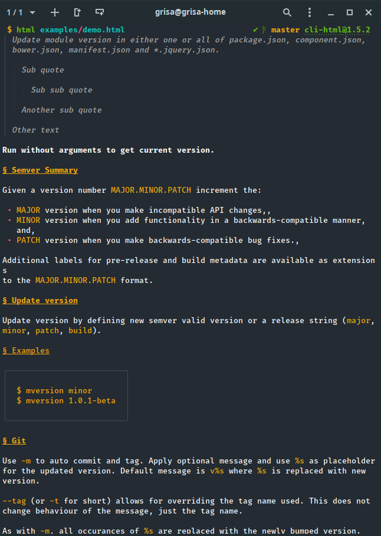

# Welcome to cli-html


[](https://github.com/horosgrisa/cli-html#readme)
[](https://github.com/horosgrisa/cli-html/graphs/commit-activity)
[](https://github.com/horosgrisa/cli-html/blob/master/LICENSE)


> Renderer HTML in the Terminal.
> Supports pretty tables and syntax highlighting

## Install

```sh
npm i -g cli-html
```

## Example

```sh
html examples/demo.html
```

This will produce the following:



## Usage as module

```sh
npm i cli-html
```

```js
import cliHtml from 'cli-html';

const html = `
<h1>Hello World</h1>
`

console.log(cliHtml(html));
```

## Run tests

```sh
npm run test
```

## Author

👤**Grigorii Horos**

* Github: [@grigorii-horos](https://github.com/grigorii-horos)

## Contributing

Contributions, issues and feature requests are welcome!

Feel free to check [issues page](https://github.com/grigorii-horos/cli-html/issues).

## Show your support

Give a ⭐️ if this project helped you!

## License

Copyright © 2019 [Grigorii Horos](https://github.com/grigorii-horos).

This project is [GPL-3.0-or-later](https://github.com/grigorii-horos/cli-html/blob/master/LICENSE) licensed.
