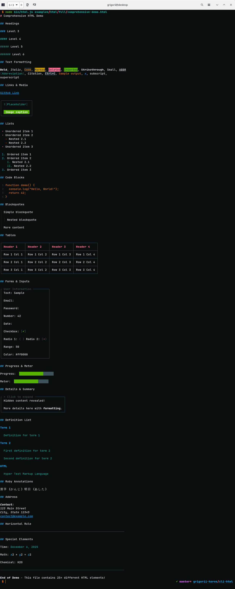

# Welcome to cli-html


[](https://github.com/grigorii-horos/cli-html#readme)
[](https://github.com/grigorii-horos/cli-html/graphs/commit-activity)
[](https://github.com/grigorii-horos/cli-html/blob/master/LICENSE)


> Renderer HTML and Markdown in the Terminal.
> Supports pretty tables, syntax highlighting, and GitHub Flavored Markdown

## Install

```sh
npm i -g cli-html
```

## Example

### HTML Rendering

```sh
# Render a full HTML document
html examples/html/full/demo.html

# Render individual tag examples
html examples/html/tags/table.html
```

This will produce the following:



### Markdown Rendering

Render Markdown files with full GitHub Flavored Markdown support:

```sh
# Render GFM alerts
markdown examples/markdown/features/alerts.md

# Render full GFM document
md examples/markdown/full/gfm-features.md
```

**Supported GFM Features:**
- ✓ **Alerts** - `[!NOTE]`, `[!TIP]`, `[!IMPORTANT]`, `[!WARNING]`, `[!CAUTION]` with colors
- ✓ **Task Lists** - `- [x]` and `- [ ]` with checkboxes
- ✓ **Tables** - Full table support with borders
- ✓ **Strikethrough** - `~~text~~`
- ✓ **Autolinks** - Automatic URL linking
- ✓ **Footnotes** - `[^1]` references
- ✓ **Definition Lists** - Term and definition pairs
- ✓ **Subscript/Superscript** - `H~2~O` and `x^2^`
- ✓ **Insert/Mark** - `++inserted++` and `==marked==` text
- ✓ **Abbreviations** - `*[HTML]: Hyper Text Markup Language`

## Usage as module

```sh
npm i cli-html
```

### Library Examples

For practical, runnable examples of using `cli-html` and `cli-markdown` as libraries, check out the [examples/library-usage](examples/library-usage) directory:

- **[html-basic.js](examples/library-usage/html-basic.js)** - Basic HTML rendering (headings, lists, tables, code blocks)
- **[markdown-basic.js](examples/library-usage/markdown-basic.js)** - GitHub Flavored Markdown features (alerts, task lists, tables)
- **[custom-theme.js](examples/library-usage/custom-theme.js)** - Custom theming examples (dark, light, vibrant themes)
- **[dynamic-content.js](examples/library-usage/dynamic-content.js)** - Generating content from data (reports, dashboards, changelogs)
- **[file-reader.js](examples/library-usage/file-reader.js)** - Reading and rendering files from disk

Run any example:
```bash
node examples/library-usage/<example-name>.js
```

See the [Library Examples README](examples/library-usage/README.md) for detailed documentation.

### API Reference

#### `renderHTML(html, theme?)`

Renders HTML content to formatted terminal output.

**Parameters:**
- `html` (string) - HTML content to render
- `theme` (object, optional) - Custom theme configuration (see [Customizing Styles](#customizing-styles))

**Returns:** `string` - Formatted terminal output

**Example:**

```js
import { renderHTML } from 'cli-html';

const html = `
<h1>Hello World</h1>
<p>This is a <strong>bold</strong> paragraph with <code>code</code>.</p>
<ul>
  <li>Item 1</li>
  <li>Item 2</li>
</ul>
`;

console.log(renderHTML(html));
```

**With custom theme:**

```js
import { renderHTML } from 'cli-html';

const customTheme = {
  h1: "magenta bold",
  code: { inline: "bgBlack yellow" }
};

const html = '<h1>Styled Title</h1>';
console.log(renderHTML(html, customTheme));
```

#### `renderMarkdown(markdown, theme?)`

Renders Markdown content to formatted terminal output with full GitHub Flavored Markdown support.

**Parameters:**
- `markdown` (string) - Markdown content to render
- `theme` (object, optional) - Custom theme configuration (see [Customizing Styles](#customizing-styles))

**Returns:** `string` - Formatted terminal output

**Example:**

```js
import { renderMarkdown } from 'cli-html';

const markdown = `
# Hello World

> [!NOTE]
> This is a note with **bold** text

- [x] Task 1
- [ ] Task 2

## Code Example

\`\`\`javascript
function greet(name) {
  return \`Hello, \${name}!\`;
}
\`\`\`
`;

console.log(renderMarkdown(markdown));
```

**With custom theme:**

```js
import { renderMarkdown } from 'cli-html';

const customTheme = {
  h1: "cyan bold",
  h2: "blue bold",
  code: {
    color: "yellowBright",
    inline: "bgBlack yellow"
  }
};

const markdown = '# Title\n\nParagraph with `code`.';
console.log(renderMarkdown(markdown, customTheme));
```

#### Default Export: `cliHtml(html, theme?)`

Alias for `renderHTML()`. Use this for backward compatibility or shorter imports.

```js
import cliHtml from 'cli-html';

const html = '<h1>Hello World</h1>';
console.log(cliHtml(html));
```

### Common Use Cases

**Reading HTML from file:**

```js
import { renderHTML } from 'cli-html';
import { readFileSync } from 'fs';

const html = readFileSync('document.html', 'utf8');
console.log(renderHTML(html));
```

**Reading Markdown from file:**

```js
import { renderMarkdown } from 'cli-html';
import { readFileSync } from 'fs';

const markdown = readFileSync('README.md', 'utf8');
console.log(renderMarkdown(markdown));
```

**Rendering dynamic content:**

```js
import { renderHTML } from 'cli-html';

const data = {
  title: 'User Report',
  items: ['Item 1', 'Item 2', 'Item 3']
};

const html = `
<h1>${data.title}</h1>
<ul>
  ${data.items.map(item => `<li>${item}</li>`).join('\n')}
</ul>
`;

console.log(renderHTML(html));
```

**Converting Markdown to HTML then to Terminal:**

```js
import { renderMarkdown } from 'cli-html';

// renderMarkdown handles the conversion internally
const markdown = '# Title\n\n**Bold** and *italic*';
console.log(renderMarkdown(markdown));
```

## Inline Style Customization

You can customize individual elements using `data-cli-*` attributes without modifying the global theme.

### Using data-cli-* Attributes

```html
<!-- Custom color and styles in a single attribute -->
<h1 data-cli-color="magenta bold">Magenta Bold Header</h1>
<h2 data-cli-color="cyan underline italic">Cyan Underlined Italic Header</h2>

<!-- Custom markers for headers -->
<h1 data-cli-marker="►">Triangle Marker</h1>
<h2 data-cli-marker="•••">Triple Dot Marker</h2>

<!-- Combined attributes -->
<h1 data-cli-color="red bold"
    data-cli-marker="⚠">
  Warning Header
</h1>

<!-- Background colors -->
<span data-cli-color="bgRed white bold">White bold on red</span>

<!-- Lists customization -->
<ol data-cli-color="green" data-cli-marker-color="red bold" data-cli-decimal=")">
  <li>Item with green text and red bold marker with ) separator</li>
  <li>Another item</li>
</ol>

<ul data-cli-color="yellow" data-cli-marker="★" data-cli-marker-color="cyan">
  <li>Item with yellow text and cyan star marker</li>
  <li>Another item</li>
</ul>
```

**Available Attributes:**
- **`data-cli-color`**: Full chalk-string specification (color + styles), e.g., `"red bold italic"`, `"bgBlue white"`
  - For `ol`/`ul`: applies to list item text
- **`data-cli-marker`**: Custom marker symbol
  - For headers/blockquotes: e.g., `"►"`, `"▌ "`, `"•••"`
  - For `ul`: custom bullet marker, e.g., `"★"`, `"►"`, `"•"`
- **`data-cli-marker-color`**: Marker color (for `ol`/`ul`), e.g., `"red bold"`, `"cyan"`
- **`data-cli-decimal`**: Decimal separator for `ol`, e.g., `")"`, `":"`, `"-"`
- **`data-cli-title-*`** (abbr/dfn):
  - `data-cli-title-color`: Title color
  - `data-cli-title-prefix-marker` / `data-cli-title-prefix-color`: Opening marker + color
  - `data-cli-title-suffix-marker` / `data-cli-title-suffix-color`: Closing marker + color

**Available Colors:**
- Basic: `black`, `red`, `green`, `yellow`, `blue`, `magenta`, `cyan`, `white`, `gray`
- Bright: `redBright`, `greenBright`, `yellowBright`, `blueBright`, `magentaBright`, `cyanBright`, `whiteBright`
- Background: `bgRed`, `bgGreen`, `bgBlue`, `bgYellow`, `bgMagenta`, `bgCyan`, `bgWhite`, etc.

**Available Styles:**
- `bold`, `italic`, `underline`, `dim`, `inverse`, `strikethrough`

**Examples:**
- Color only: `data-cli-color="red"`
- Color + style: `data-cli-color="blue bold"`
- Multiple styles: `data-cli-color="green bold italic underline"`
- Background: `data-cli-color="bgYellow black"`
- Background + styles: `data-cli-color="bgMagenta white bold"`

**Supported Tags:**
- Headers (color, marker): `h1`, `h2`, `h3`, `h4`, `h5`, `h6`
- Block (color, marker): `blockquote`
- Lists (color for text, marker-color, marker, decimal): `ol`, `ul`
- Inline (color): `span`, `strong`, `b`, `em`, `i`, `u`, `del`, `ins`, `mark`, `code`, `kbd`, `samp`, `var`, `cite`, `time`

See [examples/html/tags-custom/](examples/html/tags-custom/) for complete examples with `data-cli-*` attributes.

## 📚 Documentation

Comprehensive documentation is available in the `examples/` directory:

- **[Examples Overview](examples/README.md)** - Main documentation hub
- **[HTML Examples](examples/html/README.md)** - Complete HTML rendering guide with examples
- **[Markdown Examples](examples/markdown/README.md)** - Markdown rendering guide
- **[Customization Guide](examples/CUSTOMIZATION.md)** - Complete reference for all `data-cli-*` attributes
- **[Theme Configuration](examples/THEMES.md)** - Guide to customizing the default theme via `config.yaml`
- **[Library Usage](examples/library-usage/README.md)** - Programmatic API examples and patterns

## Customizing Styles

### For CLI Usage

Defaults live in [`config.yaml`](config.yaml) in this repository. CLI loads them, then applies your overrides from `config.yaml` in the config directory.

**Important:** Different commands use different configuration directories.

**For `html` command:**
- Linux: `~/.config/cli-html/config.yaml`
- macOS: `~/Library/Preferences/cli-html/config.yaml`
- Windows: `%LOCALAPPDATA%\cli-html\Config\config.yaml`

**For `markdown` and `md` commands:**
- Linux: `~/.config/cli-markdown/config.yaml`
- macOS: `~/Library/Preferences/cli-markdown/config.yaml`
- Windows: `%LOCALAPPDATA%\cli-markdown\Config\config.yaml`

To see the exact path for each command, run:

```sh
# For html command
node -e "import('env-paths').then(({ default: envPaths }) => console.log(envPaths('cli-html', { suffix: '' }).config))"

# For markdown/md commands
node -e "import('env-paths').then(({ default: envPaths }) => console.log(envPaths('cli-markdown', { suffix: '' }).config))"
```

1. Create the config directory if it does not exist:

   **For `html` command:**
   - Linux: `mkdir -p ~/.config/cli-html`
   - macOS: `mkdir -p ~/Library/Preferences/cli-html`
   - Windows: Create `%LOCALAPPDATA%\cli-html\Config` directory

   **For `markdown`/`md` commands:**
   - Linux: `mkdir -p ~/.config/cli-markdown`
   - macOS: `mkdir -p ~/Library/Preferences/cli-markdown`
   - Windows: Create `%LOCALAPPDATA%\cli-markdown\Config` directory
2. Add a `config.yaml` file with styles written as [chalk-string](https://www.npmjs.com/package/chalk-string) values (colors/modifiers separated by spaces). For objects, only `color` is passed to `chalk-string`; other keys are used as extra config for components.

   Available style keys: `h1`–`h6`, `span`, `a`, `figure.border.color`, `figure.border.style`, `figcaption`, `fieldset.border.color`, `fieldset.border.style`, `fieldset.title.color`, `details.border.color`, `details.border.style`, `blockquote`, `address`, `code.color`, `code.inline`, `code.numbers`, `table.header`, `table.caption`, `table.cell`, `dt`, `dd`, `dl`, `del`, `ins`, `strikethrough`, `underline`, `bold`, `samp`, `kbd`, `variableTag` (for `<var>`), `mark`, `time`, `italic`, `i`, `em`, `cite`, `abbr.color`, `abbr.title.color`, `abbr.title.prefix.marker`, `abbr.title.prefix.color`, `abbr.title.suffix.marker`, `abbr.title.suffix.color`, `dfn`, `ol.color`, `ol.markers`, `ul.color`, `ul.markers`, `hr`, `progress.filled`, `progress.empty`.

   Extra config:
   - `figure.border` supports `color` and `style` (e.g., `'single'`, `'double'`, `'round'`, `'bold'`) for configuring the border around figure elements.
   - `fieldset.border` supports `color` and `style`, and `fieldset.title.color` configures the legend text color.
   - `details.border` supports `color` and `style` for configuring the summary/details box border.
   - `ol.markers` (array) defines the numbering styles that rotate for nested ordered lists. Valid values: `'1'` (decimal), `'A'` (uppercase letters), `'a'` (lowercase letters), `'I'` (uppercase Roman), `'i'` (lowercase Roman). Default: `['1', 'I', 'A', 'i', 'a']`. HTML `type` attribute on `<ol>` tag overrides this setting.
   - `ul.markers` (array or object) controls markers for UL depth 1–3 (disc, square, circle). Example: `markers: ["+", "-", ">"]` or `markers: { disc: "+", square: "-", circle: ">" }`.
   - `code` can be configured as a string (applies to `color`) or an object with `color`, `inline`, and `numbers` properties. Supports fallback: `code.color` ← `code`, `code.inline` ← `inlineCode` (legacy), `code.numbers` ← `codeNumbers` (legacy).
   - `table` can be configured as nested object with `header`, `caption`, and `cell` properties. Supports fallback from legacy `tableHeader`, `tableCaption`, `tableCell`.
   - `abbr` can be configured as a string (applies to `color`) or an object with `color`, `title` (with `color`, `prefix.marker/color`, `suffix.marker/color`). Supports fallback from legacy `abbr`, `abbrTitle`, `abbrParens`.
   - `progress` supports flexible fallback configuration:
     - **For filled**: checks `progress.filled.color` → `progress.filled` (if string) → `progress.color` → `progress` (if string) → base theme
     - **For empty**: checks `progress.empty.color` → `progress.empty` (if string) → base theme
     - Both support `symbol` property to customize the progress bar character (default: `█`)
   - Legacy: `config.yml` or `theme.yml` will also be read if present.

Example config file (paths vary by OS and command, see above):

```yml
theme:
  h1: "magenta bold"
  a: "cyan underline"
  figure:
    border:
      color: "blue"
      style: "double"
  fieldset:
    border:
      color: "cyan"
      style: "bold"
    title:
      color: "magenta"
  details:
    border:
      color: "green"
      style: "round"
  blockquote: "gray"
  code:
    color: "yellowBright"
    inline: "bgBlack yellow"
    numbers: "blackBright dim"
  table:
    header: "red bold"
    caption: "bold blue"
    cell: ""
  variableTag: "blue italic"
  mark: "bgYellow black"
  abbr:
    color: "underline"
    title: "cyan"
    parens: "gray"
  ol:
    color: ""  # Text color for list items (empty = no color)
    markers:   # Marker configuration by type
      "1":
        color: "blueBright"   # Marker color
        marker: "1"           # Marker type
        decimal: "."          # Decimal separator
      I:
        color: "cyanBright"
        marker: "I"
        decimal: "."
      A:
        color: "magentaBright"
        marker: "A"
        decimal: "."
      i:
        color: "blueBright"
        marker: "i"
        decimal: "."
      a:
        color: "cyanBright"
        marker: "a"
        decimal: "."
    indent: "   "  # Indentation for nested items
  ul:
    color: ""  # Text color for list items (empty = no color)
    markers:   # Marker configuration by type
      disc:
        color: "redBright"    # Marker color
        marker: "•"           # Marker symbol
      square:
        color: "yellowBright"
        marker: "▪"
      circle:
        color: "cyanBright"
        marker: "⚬"
    indent: "  "  # Indentation for nested items
  hr: "gray"
  progress:
    filled:
      color: "bgGreen white"
      symbol: "█"
    empty:
      color: "bgBlack gray"
      symbol: "█"
```

You can also use shorter forms for `progress`:

```yml
# Simple string (applies to filled only)
progress: "green"

# Object with shared color for filled
progress:
  color: "blue"
  filled: "green"  # String override
  empty:
    color: "gray"
    symbol: "░"
```

3. Run the appropriate command — the custom styles will be applied automatically:
   - `html your-file.html` loads config from the `cli-html` directory
   - `markdown your-file.md` or `md your-file.md` loads config from the `cli-markdown` directory

### For Library Usage

When using `cli-html` as a library, you can pass a custom theme object as the second parameter to both `cliHtml()` and `renderMarkdown()`:

```js
import cliHtml, { renderMarkdown } from 'cli-html';

const customTheme = {
  h1: "magenta bold",
  h2: "cyan bold",
  a: "blue underline",
  blockquote: "gray italic",
  code: {
    color: "yellowBright",
    inline: "bgBlack yellow",
    numbers: "dim"
  },
  table: {
    header: "red bold",
    caption: "bold blue",
    cell: ""
  },
  ul: {
    color: "",  // Text color for list items
    markers: {
      disc: { color: "green", marker: "•" },
      square: { color: "yellow", marker: "▪" },
      circle: { color: "cyan", marker: "⚬" }
    },
    indent: "  "
  },
  ol: {
    color: "",  // Text color for list items
    markers: {
      "1": { color: "blueBright", marker: "1", decimal: "." },
      I: { color: "cyanBright", marker: "I", decimal: "." },
      A: { color: "magentaBright", marker: "A", decimal: "." },
      i: { color: "blueBright", marker: "i", decimal: "." },
      a: { color: "cyanBright", marker: "a", decimal: "." }
    },
    indent: "   "
  },
  progress: {
    filled: {
      color: "bgGreen white",
      symbol: "█"
    },
    empty: {
      color: "bgBlack gray",
      symbol: "░"
    }
  }
};

// HTML rendering with custom theme
const html = '<h1>Hello</h1><p>This is <code>inline code</code></p>';
console.log(cliHtml(html, customTheme));

// Markdown rendering with custom theme
const markdown = '# Hello\n\nThis is `inline code`';
console.log(renderMarkdown(markdown, customTheme));
```

The theme object uses the same structure and keys as the CLI `config.yaml` file. Values should be [chalk-string](https://www.npmjs.com/package/chalk-string) compatible strings (e.g., `"red bold"`, `"bgBlue white underline"`).

**Available theme keys:**
- **Headings**: `h1`, `h2`, `h3`, `h4`, `h5`, `h6`
- **Text styles**: `bold`, `italic`, `i`, `em`, `underline`, `strikethrough`, `del`, `ins`, `mark`, `cite`, `samp`, `kbd`, `variableTag`, `abbr`, `dfn`, `time`
- **Links**: `a`, `span`
- **Block elements**: `blockquote`, `address`, `hr`
- **Code**: `code` (string or object with `color`, `inline`, `numbers`)
- **Lists**: `ul` (with `color` for text, `markers` array with `marker.color` and `marker.marker`, `indent`), `ol` (with `color` for text, `markers` array with `marker.color`, `marker.marker`, and `marker.decimal`, `indent`), `dl`, `dt`, `dd`
- **Tables**: `table` (object with `header`, `caption`, `cell`)
- **Borders**: `figure` (with `border.color`, `border.style`), `fieldset` (with `border.color`, `border.style`, `title.color`), `details` (with `border.color`, `border.style`)
- **Progress bars**: `progress` (object with `filled` and `empty`, each having `color` and `symbol`)

If you don't provide a theme object, the default theme from `config.yaml` will be used.

## Syntax Highlighting

Code blocks support automatic syntax highlighting using [cli-highlight](https://www.npmjs.com/package/cli-highlight). To enable syntax highlighting for a code block, add a `language-*` or `lang-*` class to the `<code>` element:

```html
<pre><code class="language-javascript">
function hello() {
  console.log("Hello, World!");
  return true;
}
</code></pre>
```

Supported languages include: `javascript`, `typescript`, `python`, `java`, `sql`, `bash`, `json`, `yaml`, `nginx`, `go`, `rust`, and many more.

**Example:**

```html
<!-- JavaScript -->
<pre><code class="language-javascript">
const user = await User.findById(id);
</code></pre>

<!-- Python -->
<pre><code class="language-python">
def hello():
    print("Hello, World!")
</code></pre>

<!-- SQL -->
<pre><code class="language-sql">
SELECT * FROM users WHERE email = 'user@example.com';
</code></pre>

<!-- Bash -->
<pre><code class="language-bash">
npm install express
</code></pre>
```

Code blocks without a language class will still be displayed but without syntax highlighting.

See the comprehensive examples in `examples/html/full/documentation.html`, `examples/html/full/blog.html`, and `examples/html/full/tutorial.html` for more syntax highlighting examples.

## Run tests

```sh
npm run test
```

## Author

👤**Grigorii Horos**

* Github: [@grigorii-horos](https://github.com/grigorii-horos)

## Contributing

Contributions, issues and feature requests are welcome!

Feel free to check [issues page](https://github.com/grigorii-horos/cli-html/issues).

## Show your support

Give a ⭐️ if this project helped you!

## License

Copyright © 2019 [Grigorii Horos](https://github.com/grigorii-horos).

This project is [GPL-3.0-or-later](https://github.com/grigorii-horos/cli-html/blob/master/LICENSE) licensed.
