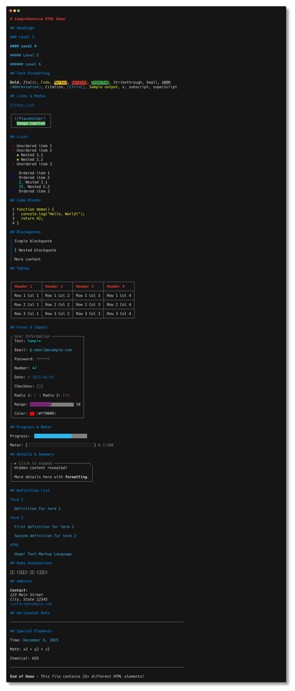
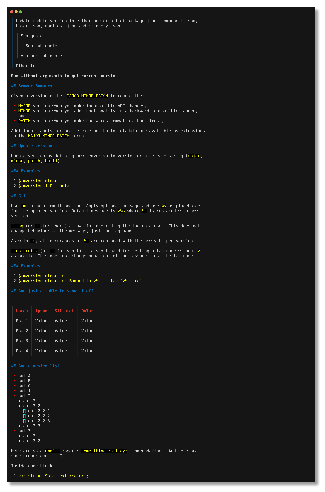
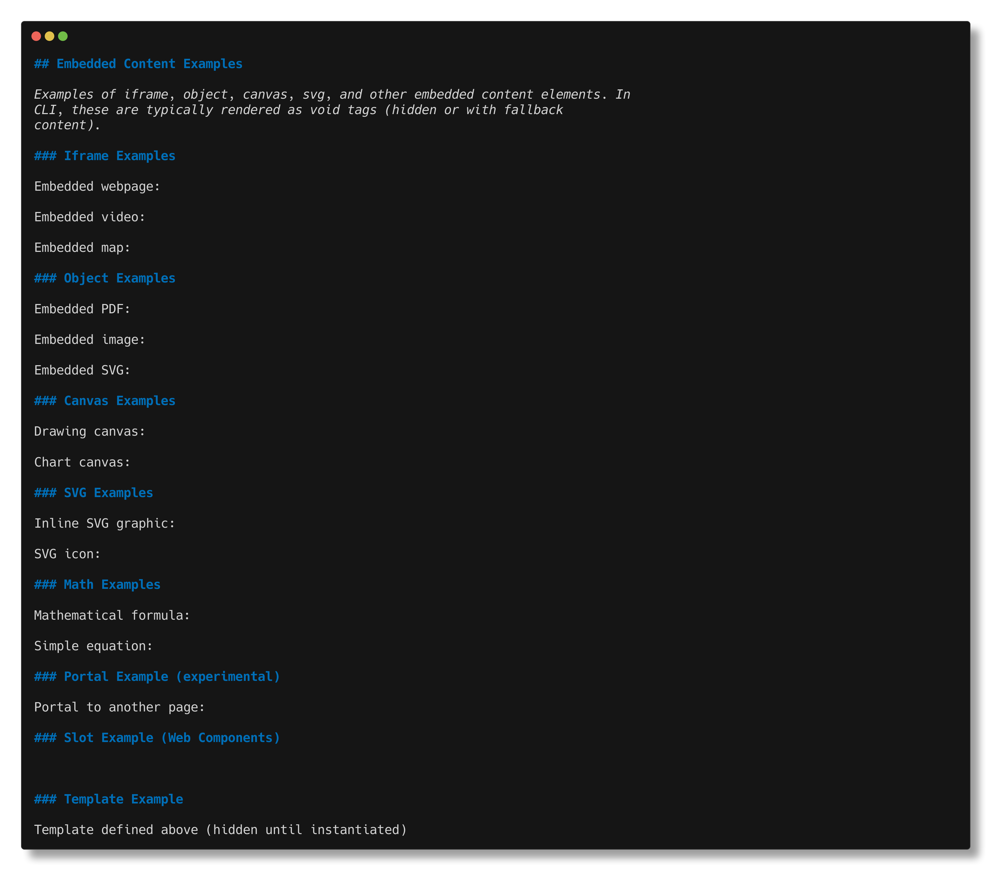

# Full HTML Examples

This directory contains complete, real-world HTML examples demonstrating complex layouts and comprehensive usage of the HTML-to-terminal renderer.

## Overview

These examples showcase:
- Complex document structures
- Multiple sections and nested elements
- Real-world use cases (blogs, dashboards, reports, tutorials)
- Combination of various HTML tags and styles

## Running the Examples

```bash
# View a specific example
html examples/html/full/blog.html

# Or run from the project root
node bin/html.js examples/html/full/blog.html
```

## Screenshots

### Blog


### Comprehensive Demo


### Dashboard


### Demo


### Documentation


### Embedded


### Report


### Tutorial


## See Also

- [Main README](../../../README.md) - Full documentation
- [../tags/](../tags/) - Standard tag examples
- [../tags-custom/](../tags-custom/) - Examples with custom inline styles
