# Markdown Features Examples

This directory contains examples demonstrating individual Markdown features and syntax.

## Overview

These examples showcase specific Markdown features including:
- Headers and emphasis
- Lists and task lists
- Code blocks with syntax highlighting
- Tables
- Blockquotes
- Links
- Horizontal rules
- Footnotes
- Definitions
- Abbreviations
- GitHub Flavored Markdown alerts

## Running the Examples

```bash
# View a specific example
md examples/markdown/features/headings.md

# Or run from the project root
node bin/markdown.js examples/markdown/features/headings.md
```

## Screenshots

### Abbreviations
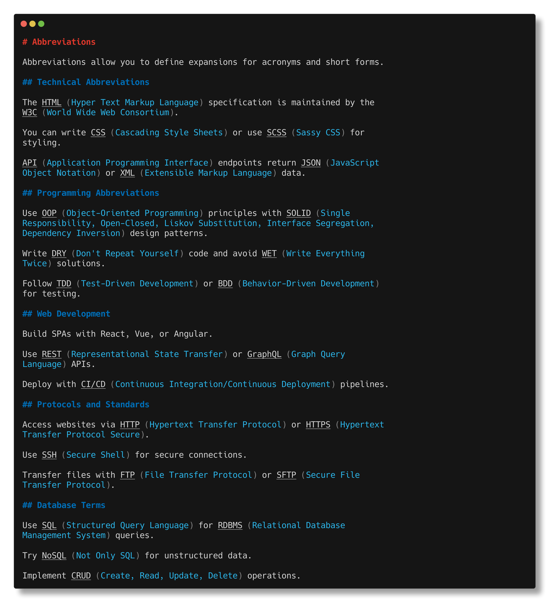

### Alerts
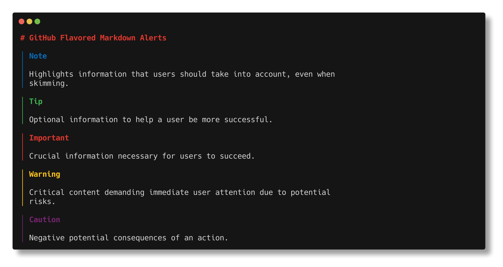

### Blockquotes
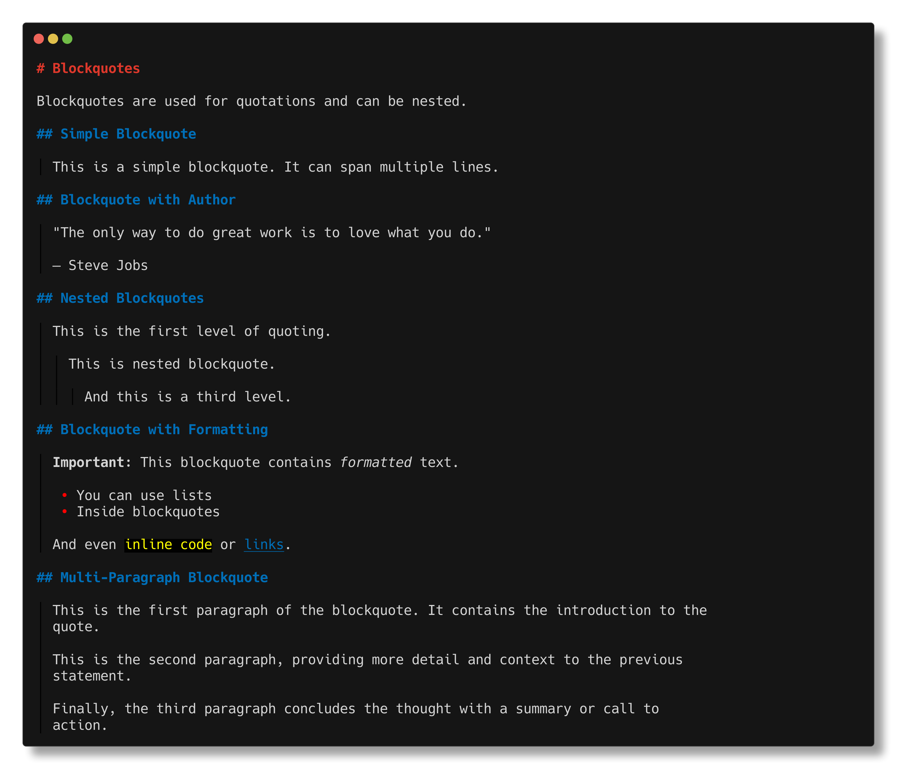

### Code Blocks
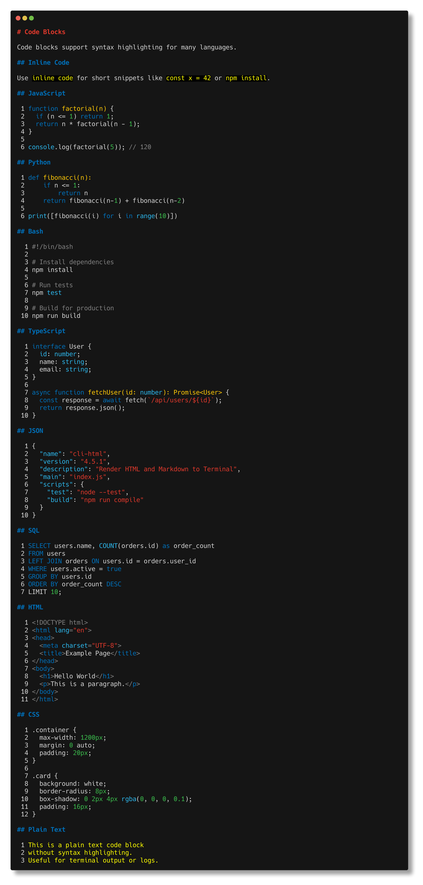

### Definitions
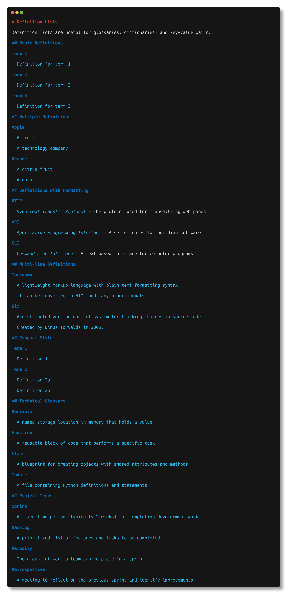

### Emphasis
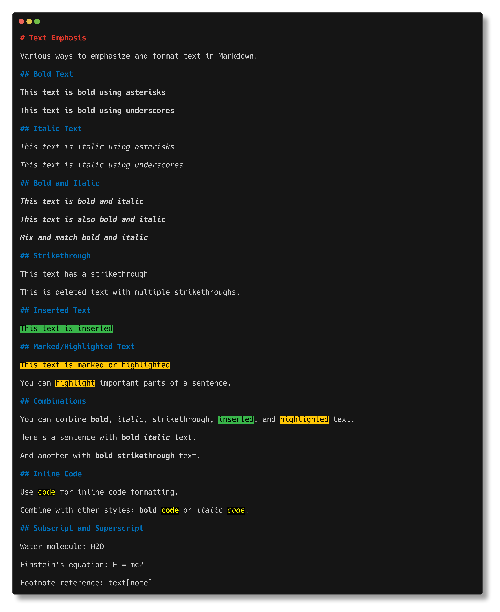

### Footnotes
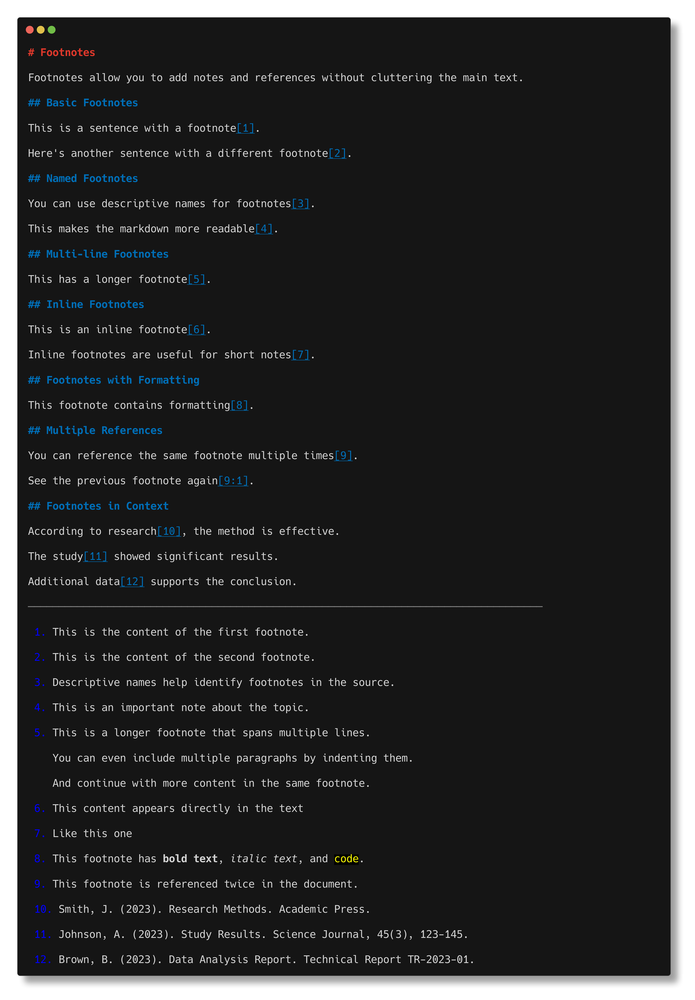

### Headings
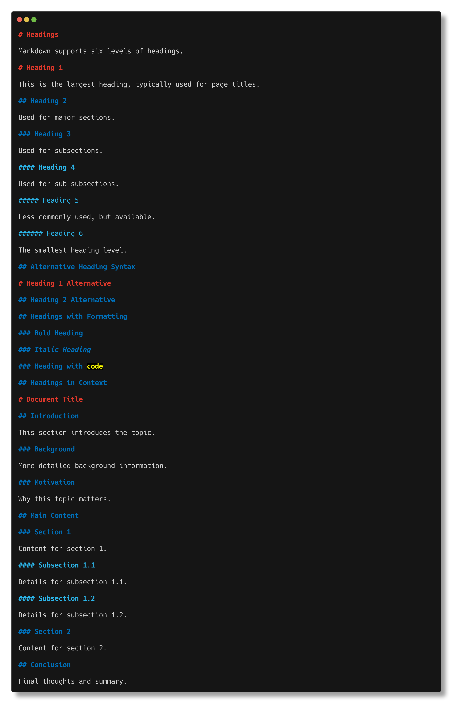

### Horizontal Rules
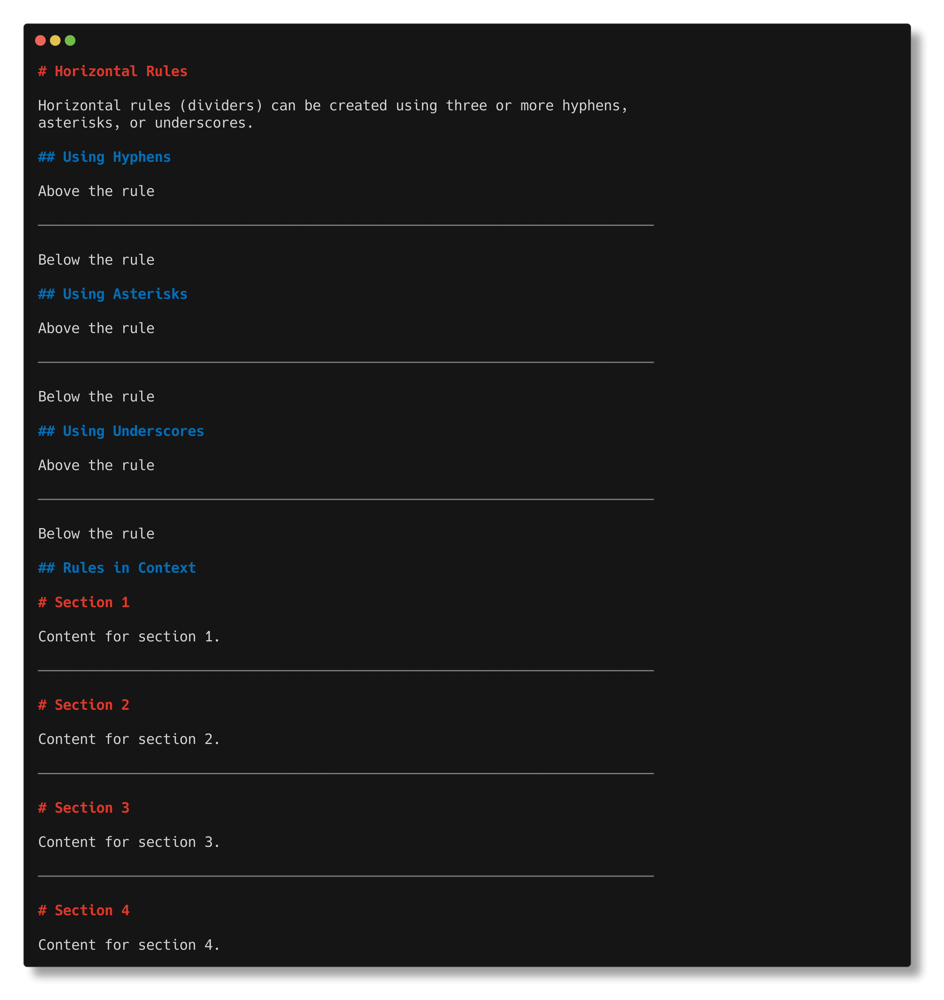

### Links
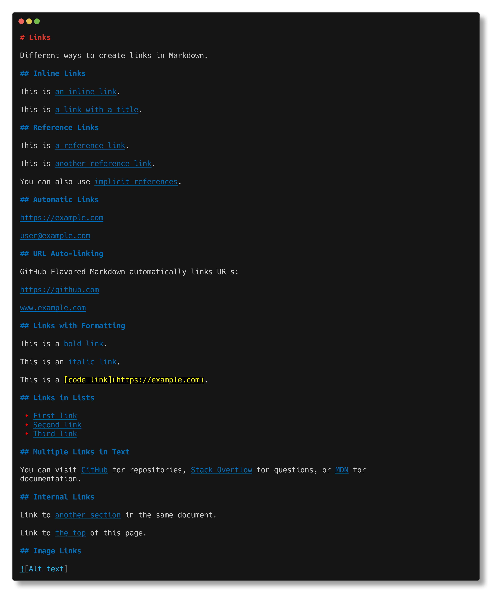

### Lists
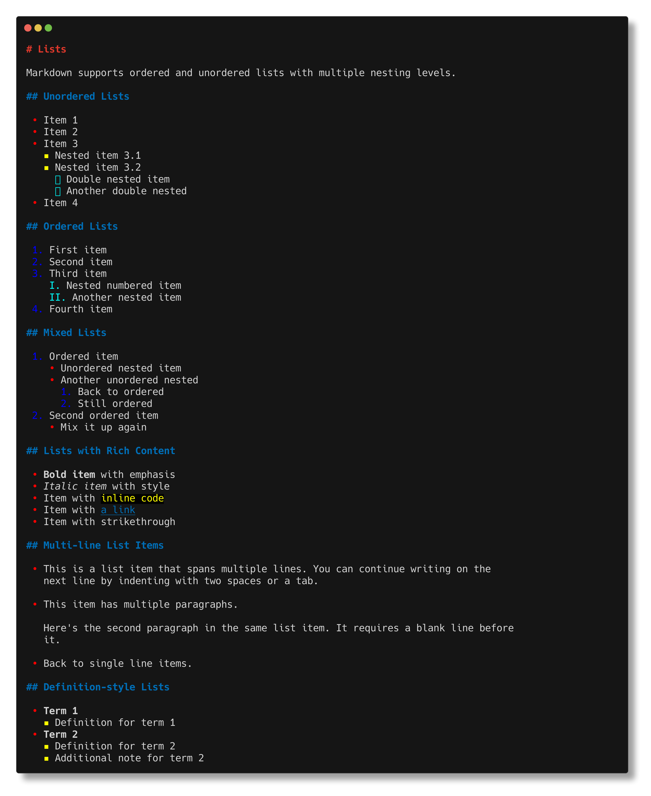

### Tables
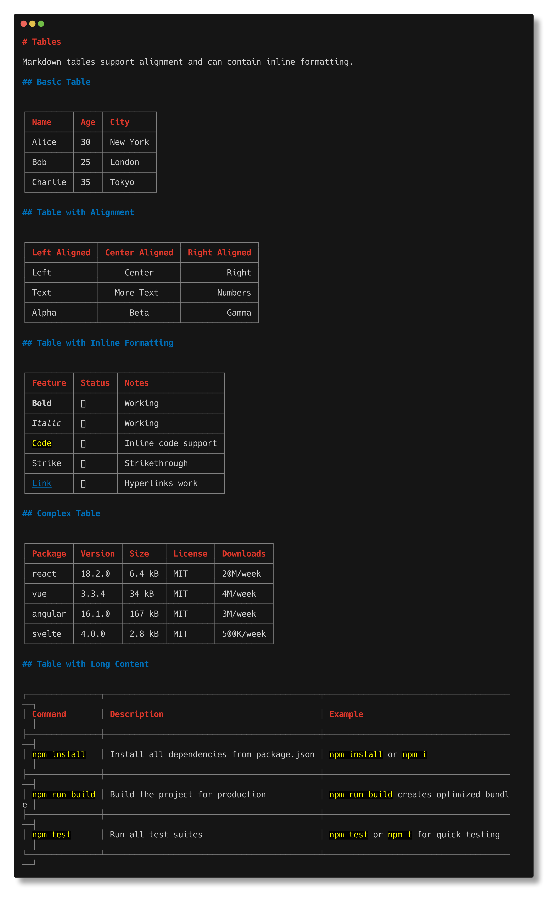

### Task Lists


## See Also

- [Main README](../../../README.md) - Full documentation
- [../full/](../full/) - Complete markdown document examples
- [Markdown Guide](https://www.markdownguide.org/) - External markdown reference
